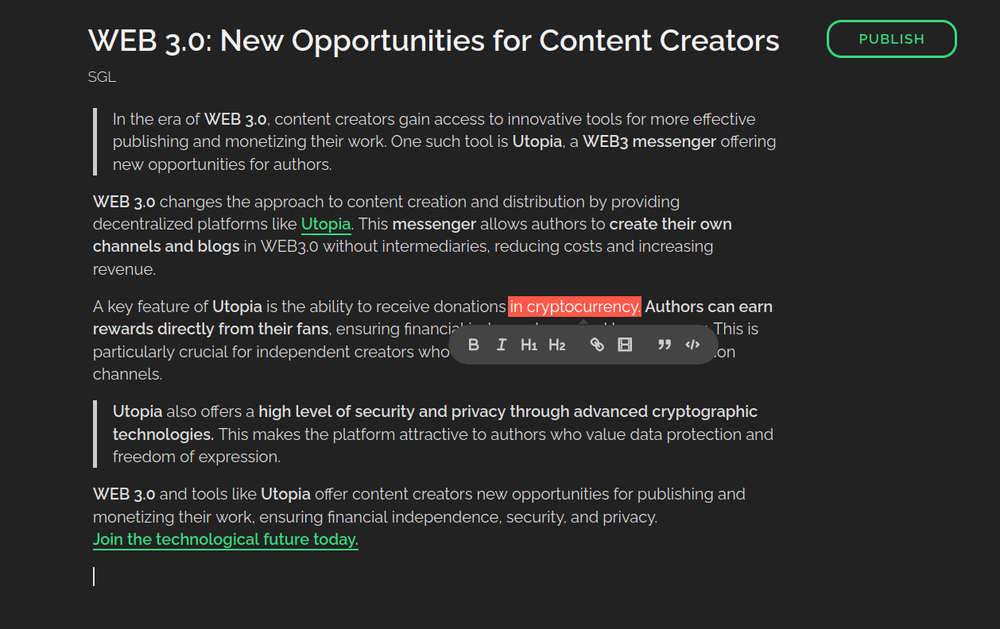

## uWrite - Free service for publishing content in WEB3.0

----------
**How to install?**

 - Clone repo.
 - There is a SQL table in *sql.sql*, insert it to your database.
 - Edit config.php, fill your DB details and you're ready to go.

----------
**Requirements:**

 - PHP 5.0.7 or newer
 - MySQL 5 with InnoDB support

----------
**How to access:**

[Install Utopia](https://u.is/) if you haven't already. Then open Idyll Browser and enter the address in the address bar: `uwrite`

## Useful resources

* [How to create WEB 3.0 chatbots](https://udocs.gitbook.io/utopia-api/utopia-api/creating-chat-bots).
* [How to earn in WEB 3.0](https://udocs.gitbook.io/utopia-api/how-to-earn-in-web-3.0)
* [Examples of projects](https://udocs.gitbook.io/utopia-api/utopia-api/examples-of-projects) created based on the Utopia API.
* [Official website](https://u.is/en/) of the Utopia P2P project.
* Service with music directly in Idyll Browser: just enter the address **"umusic"** in the browser.

